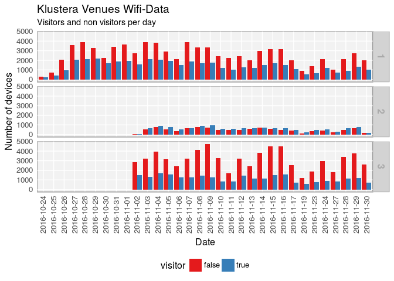
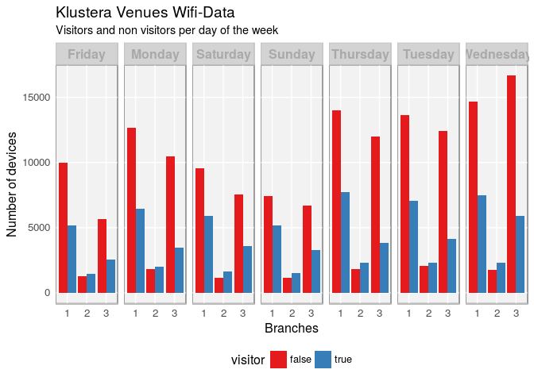
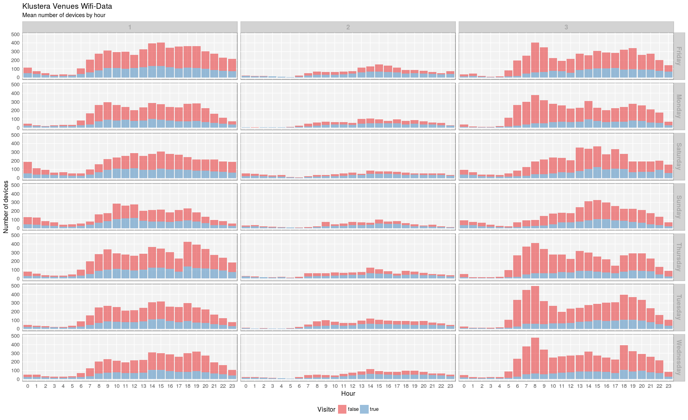
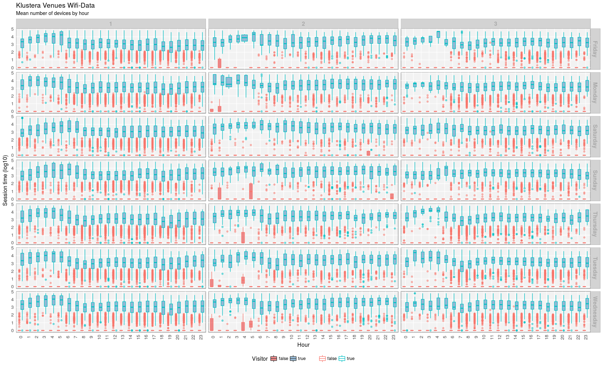
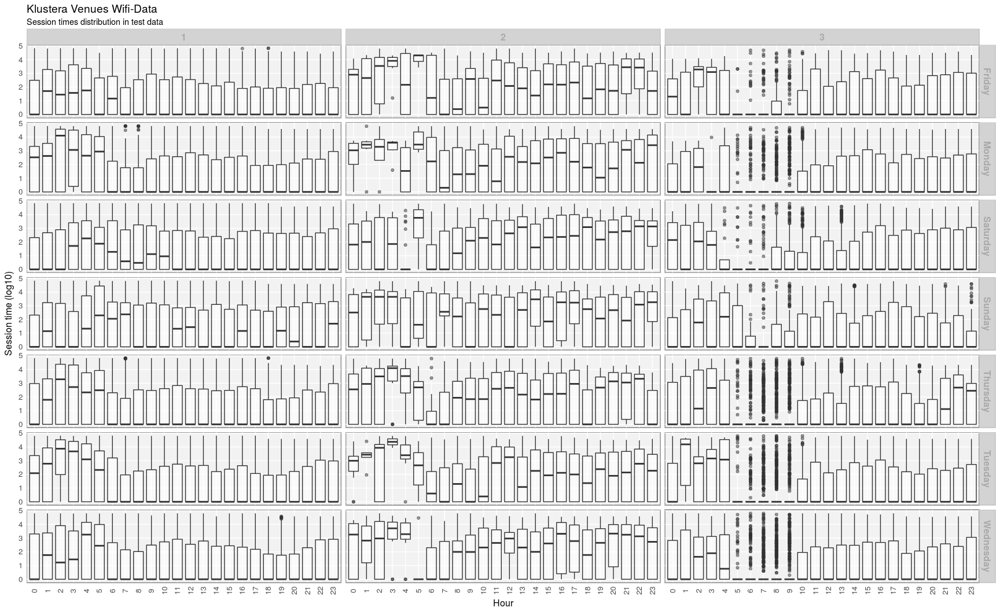
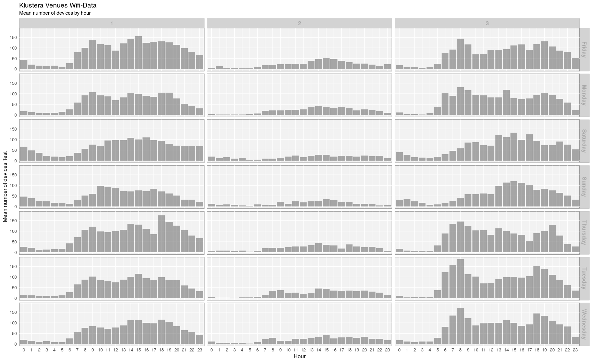
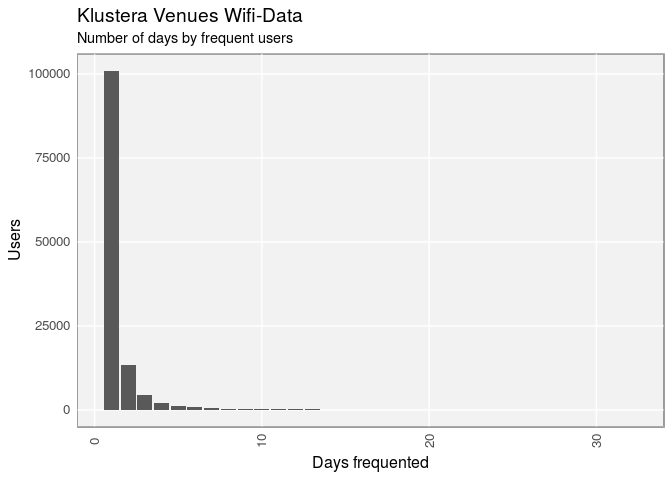
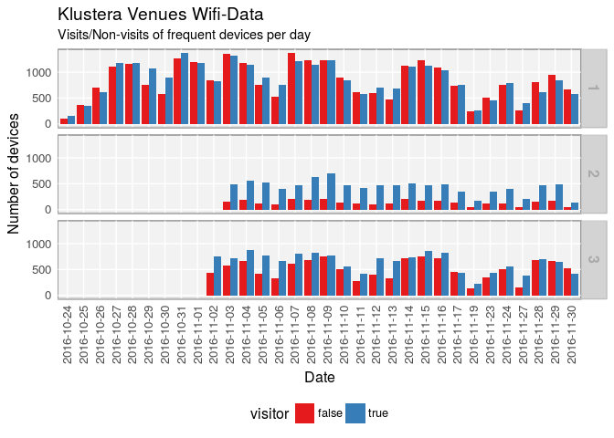
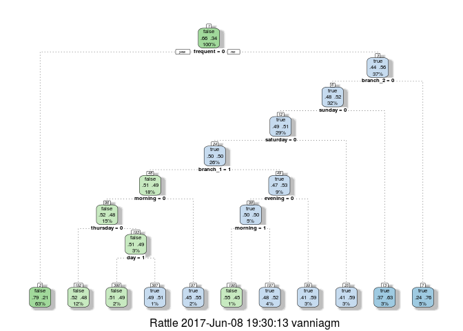
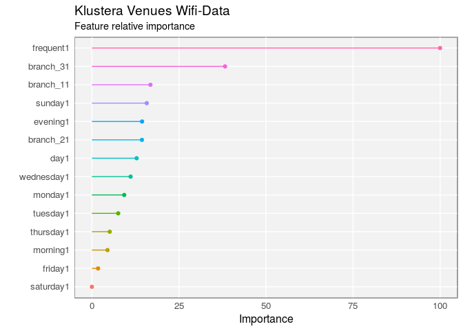

# Business visitors according to Klustera data from wifi devices 
Vannia Gonzalez  


## Synopsis

This data project is an exploration of the number of visitors and non visitors and their session times to different venues in Mexico City across a period of 32 days. My aim is to predict if the user is a visitor or not (outcome) and his/her session times using machine learning algorithms.

The data was collected by Klustera during a period of 32 days in October-November 2016 in 3 different venues or branches in Mexico City. The dataset documents when a user's device is detected in the venue (using Klustera technology), its session time and reports whether or not the user is a visitor of the venue. The file "e.csv" contains the training data while "v.csv" contains the validating (or test) data; the file "segment.csv" contains two segmentation values for each user mac address device. I will show an analysis on the cross data from the training dataset "e.csv" and the segment dataset "segment.csv".


## Data processing

### 1. Downloading and reading the database


```r
df_e<-read.csv("data/e.csv",header = TRUE)
df_v<-read.csv("data/v.csv",header = TRUE)
```

```r
library(lubridate)
library(plyr)
library(reshape2)
library(ggplot2)
library(knitr)
library(dplyr)
library(tidyr)
library(scales)
library(caret)
library(rpart)
library(rattle)
library(rpart.plot)
library(RColorBrewer)
```

### Exploratory analysis of the training dataset

Sample of data

```r
head(df_e)
```

```
##   X        device_mac branch_office month_tz day_tz day_of_week_tz hour_tz
## 1 1 00:00:00:6a:17:ce             1       11      2      Wednesday       0
## 2 2 00:00:00:6a:17:ce             1       11      2      Wednesday       1
## 3 3 00:00:00:6a:78:ae             1       10     30         Sunday      20
## 4 4 00:00:02:fa:9c:12             1       11     13         Sunday      12
## 5 5 00:00:08:7d:e2:58             3       11      4         Friday      19
## 6 6 00:00:31:04:ad:89             3       11      3       Thursday       5
##   visitor tiempodeses
## 1    true        2676
## 2    true        2676
## 3   false           0
## 4    true        2272
## 5   false           0
## 6   false           0
```

The dataset contains a unique device mac address, branch office, the month, day, day of the week, hour, visitor (logical variable) and session time. 

 * Checking for missing or null values
 

```r
checknanull<-function(x){c(sum(is.na(x)),sum(is.null(x)))}
apply(df_e,2,checknanull)
```

```
##      X device_mac branch_office month_tz day_tz day_of_week_tz hour_tz
## [1,] 0          0             0        0      0              0       0
## [2,] 0          0             0        0      0              0       0
##      visitor tiempodeses
## [1,]       0           0
## [2,]       0           0
```

I will create a new POSIXct variable in case I need it for plotting.

```r
df_e$Date<-as.POSIXct(
        paste(
                paste(df_e$month_tz,df_e$day_tz,"2016",sep="/"),df_e$hour_tz,sep=" "
        ),
        format="%m/%d/%Y %H",tz="CST"
        )
```

This is just to corroborate that the year is 2016 (since it was not given in the dataset)

```r
df_e$Wkd<-weekdays(df_e$Date)
df_e$day_of_week_tz<-as.character(df_e$day_of_week_tz)
sum(!(df_e$day_of_week_tz==df_e$Wkd))
```

```
## [1] 0
```

In order to do feauture engineering I will explore the distribution of the data points and their variables by plotting them. I am interested in distributions such as visitors (and non-visitors) per day by branch office, or per hour or day of the week.


```r
gral_theme <- function(size=12,family='sans'){
        theme_minimal(base_size =size, base_family = family) +
                theme(
                        axis.text = element_text(size = 10),
                        axis.text.x = element_text(angle = 0, vjust = 0.5, hjust = 0.5),
                        axis.title = element_text(size = 12),
                        panel.grid.major = element_line(color = "white"),
                        panel.grid.minor = element_blank(),
                        panel.background = element_rect(fill = "grey95"),
                        strip.background = element_rect(fill = "lightgrey", color = "grey"),
                        strip.text = element_text(face = "bold", size = 12, color = "darkgrey"),
                        legend.position = "bottom",
                        legend.justification = "top",
                        legend.box = "horizontal",
                        legend.background = element_blank(),
                        panel.border = element_rect(color = "grey", fill = NA, size = 0.5)
                )}
```

 * Peak day


```r
g<-ggplot(data=df_e,aes(x=as.factor(as.Date(Date)),fill=visitor))+geom_bar(position='dodge')
g+
        facet_grid(branch_office~.)+
        gral_theme()+theme(axis.text.x = element_text( angle=90))+
        scale_fill_brewer(palette="Set1")+
        labs(x="Date",y="Number of devices",title="Klustera Venues Wifi-Data",subtitle="Visitors and non visitors per day")
```

<!-- -->

This plot shows the distribution of devices across the period of time for each branch. The colors distinguish wheteher the user is a visitor or not. 
It seems that the 2nd and 3th branches have no data before the 2nd of Nov. 

 * Peak day of the week
 

```r
g<-ggplot(data=df_e,aes(x=branch_office,fill=visitor))+geom_bar(position='dodge')
g+
        facet_grid(.~weekdays(df_e$Date))+
        labs(x="Branches",y="Number of devices",title="Klustera Venues Wifi-Data",subtitle="Visitors and non visitors per day of the week")+
        gral_theme()+scale_fill_brewer(palette="Set1")
```

<!-- -->

The former plot shows the distribution of the devices for each branch office across the different days of the week and whether the user visited or not. The former two plots seem to indicate that a user was not a visitor most frequently on Sundays for example. 

 * Mean visits per hour and weekday
 

```r
df_agg<-aggregate(df_e,by=list(df_e$Date,df_e$branch_office,df_e$visitor,df_e$day_of_week_tz),length)[1:5]
df_agg$hour<-hour(df_agg$Group.1)
#Mean of reported devices by hour
df_meanh<-aggregate(df_agg$X,by=list(df_agg$hour,df_agg$Group.2,df_agg$Group.3,df_agg$Group.4),mean)
#df_meanh<-aggregate(X~hour+Group.2+Group.3,df_agg,mean)
df_meanh$branches<-mapvalues(df_meanh$Group.2,from=c(1,2,3),to=c("Branch_1","Branch_2","Branch_3"))

g5<-ggplot(data=df_meanh,aes(x=as.factor(Group.1),y=x,fill=Group.3))+geom_bar(stat='identity',alpha=.5)
g5+facet_grid(Group.4~Group.2)+
        labs(x="Hour",y="Number of devices",title="Klustera Venues Wifi-Data",subtitle="Mean number of devices by hour",fill="Visitor",col="")+
        gral_theme()+scale_fill_brewer(palette="Set1")
```

<!-- -->

This plot is useful to see the distribution of devices across the 24 hours of the day for each branch and weekday and if the user is a visitor or not. We can see that the period of the day seems to indicate if a user did not visit the venue, while visiting the venue did not depend as much on the period of the day, that is it was consistent. There is an obvious decline during the early hours of the day when people is asleep for all branches everyday.

 * Session times by hour and day of the week
 

```r
df_e$tiemlog0<-mapvalues(df_e$tiempodeses,from=0,to=1)
g<-ggplot(
        data=df_e,
        aes(x=as.factor(hour(Date)),y=log10(as.numeric(tiemlog0)),fill=visitor,col=visitor))
g+
        geom_boxplot(alpha=.5)+
        facet_grid(weekdays(Date)~branch_office)+
        labs(x='Hour',y='Session time (log10)',fill='Visitor',col="",title="Klustera Venues Wifi-Data",subtitle="Mean number of devices by hour")+
        gral_theme()+theme(axis.text.x = element_text(angle = 90, vjust = 0.5, hjust = 0.5))+scale_fill_brewer(palette="Set1")
```

<!-- -->

Note that there is a consistent peak in session time at early hours of the day, that is when people is usually asleep, I can not find an explanation for this.


## Test data

The following plots show the distribution of the data points (devices and session times) according to the hour and day of the week of the test dataset as a comparison (with no visitor variable).


```r
df_v$Date<-as.POSIXct(
        paste(
                paste(df_v$month_tz,df_v$day_tz,"2016",sep="/"),df_v$hour_tz,sep=" "
        ),
        format="%m/%d/%Y %H",tz="CST"
)
df_v$seslog0<-mapvalues(df_v$tiempodeses,from=0,to=1)
gses<-ggplot(
        data=df_v,
        aes(x=as.factor(hour(Date)),y=log10(as.numeric(seslog0))))
gses+
        geom_boxplot(alpha=.5)+
        scale_fill_brewer()+
        facet_grid(weekdays(Date)~branch_office)+
        labs(x='Hour',y='Session time (log10)',title="Klustera Venues Wifi-Data",subtitle="Session times distribution in test data")+
        gral_theme()+theme(axis.text.x = element_text(angle = 90, vjust = 0.5, hjust = 0.5))+
        scale_fill_brewer(palette="Set1")
```

```
## Scale for 'fill' is already present. Adding another scale for 'fill',
## which will replace the existing scale.
```

<!-- -->

```r
# Devices by hour and weekday (mean num. of devices)
df_agg<-aggregate(df_v,by=list(df_v$Date,df_v$branch_office,df_v$day_of_week_tz),length)[1:4]
df_agg$hour<-hour(df_agg$Group.1)
#Mean of reported devices by hour
df_meanh<-aggregate(df_agg$X,by=list(df_agg$hour,df_agg$Group.2,df_agg$Group.3),mean)
#df_meanh<-aggregate(X~hour+Group.2+Group.3,df_agg,mean)
df_meanh$branches<-mapvalues(df_meanh$Group.2,from=c(1,2,3),to=c("Branch_1","Branch_2","Branch_3"))
g5<-ggplot(data=df_meanh,aes(x=as.factor(Group.1),y=x))+geom_bar(stat='identity',alpha=.5)
g5+facet_grid(Group.3~Group.2)+
        labs(x='Hour',y='Mean number of devices Test',title="Klustera Venues Wifi-Data",subtitle='Mean number of devices by hour')+
        gral_theme()+scale_fill_brewer(palette="Set1")
```

<!-- -->


## Features

The are not many features so I will create new variables:

 1. There may be users that are frequent clients, I will create a frequent variable for users or devices that appear 4 or more times on the period the data was collected ~ 1 month (for different days on the total period of time).
 2. I will convert Weekdays to binaries
 3. I will convert branch_office to binaries
 4. I will divide the hour variable in three periods: morning, day, evening and convert each to binaries
 
 * Frequent user


```r
# Frequent users
df_eDays<-aggregate(df_e$X,by=list(df_e$device_mac,as.Date(df_e$Date)),length)
df_eDays<-aggregate(Group.2~Group.1,df_eDays,length)
names(df_eDays)<-c("dev","days")
max(df_eDays$days)
```

```
## [1] 32
```

```r
length(df_eDays$dev[df_eDays$days==1]) #100975
```

```
## [1] 100975
```

```r
summary(df_eDays$days) #median is ~ 1.5
```

```
##    Min. 1st Qu.  Median    Mean 3rd Qu.    Max. 
##   1.000   1.000   1.000   1.495   1.000  32.000
```

```r
ggplot(df_eDays,aes(x=days))+geom_bar()+
        gral_theme()+
        theme(axis.text.x = element_text( angle=90))+
        labs(x="Days frequented",y="Users",title="Klustera Venues Wifi-Data",subtitle="Number of days by frequent users")+scale_fill_brewer(palette="Set1")
```

<!-- -->

So around 80 % of the devices are visitors/non-visitors for only one day.

I will asume that any user (device) that is a visitor/non-visitor for 4 or more days is frequent (in a 32 day period). 

Now I will show if frequent users are visitors or non visitors. For this I subset the data with those frequent users (devices).


```r
df_freq<-df_eDays$dev[df_eDays$days>3] #length=6468 
df_efreq<-df_e[df_e$device_mac %in% df_freq,] # frequent users
df_enofreq<-df_e[!df_e$device_mac %in% df_freq,] #not frequent

g4<-ggplot(data=df_efreq,aes(x=as.factor(as.Date(Date)),fill=visitor))+geom_bar(position='dodge')
g4+
        facet_grid(branch_office~.)+
        gral_theme()+
        theme(axis.text.x = element_text( angle=90))+
        labs(x="Date",y="Number of devices",title="Klustera Venues Wifi-Data",subtitle="Visits/Non-visits of frequent devices per day")+scale_fill_brewer(palette="Set1")
```

<!-- -->

```r
g4<-ggplot(data=df_enofreq,aes(x=as.factor(as.Date(Date)),fill=visitor))+geom_bar(position='dodge')
g4+
        facet_grid(branch_office~.)+
        gral_theme()+
        theme(axis.text.x = element_text( angle=90))+
        labs(x="Date",y="Number of devices",title="Klustera Venues Wifi-Data",subtitle="Visits/Non-visits of NON frequent devices per day")+scale_fill_brewer(palette="Set1")
```

<!-- -->
 
There is a clear relation between non frequent devices and non visitors. Frequent devices are just slightly more likely to be visitors (comparing with the the first figure of this document).


 * Creating frequent feature for test data


```r
df_vDays<-aggregate(df_v$X,by=list(df_v$device_mac,as.Date(df_v$Date)),length)
df_vDays<-aggregate(Group.2~Group.1,df_vDays,length)
names(df_vDays)<-c("dev","days")
max(df_vDays$days)
```

```
## [1] 32
```

```r
length(df_vDays$dev[df_vDays$days==1]) #100975
```

```
## [1] 47407
```

```r
df_freqv<-df_vDays$dev[df_vDays$days>3] #length=6468 
df_vfreq<-df_v[df_v$device_mac %in% df_freqv,] # frequent users
df_vnofreq<-df_v[!df_v$device_mac %in% df_freqv,]
```


 * Preparing datasets

       

```r
df_pre<-df_e %>%
        mutate(frequent=as.factor(ifelse(df_e$device_mac%in%df_freq,1,0)),
               branch_1=as.factor(ifelse(df_e$branch_office==1,1,0)),
               branch_2=as.factor(ifelse(df_e$branch_office==2,1,0)),
               branch_3=as.factor(ifelse(df_e$branch_office==3,1,0)),
               monday=as.factor(ifelse(df_e$day_of_week_tz=="Monday",1,0)),
               tuesday=as.factor(ifelse(df_e$day_of_week_tz=="Tuesday",1,0)),
               wednesday=as.factor(ifelse(df_e$day_of_week_tz=="Wednesday",1,0)),
               thursday=as.factor(ifelse(df_e$day_of_week_tz=="Thursday",1,0)),
               friday=as.factor(ifelse(df_e$day_of_week_tz=="Friday",1,0)),
               saturday=as.factor(ifelse(df_e$day_of_week_tz=="Saturday",1,0)),
               sunday=as.factor(ifelse(df_e$day_of_week_tz=="Sunday",1,0)),
               morning=as.factor(ifelse(df_e$hour_tz<8,1,0)),
               day=as.factor(ifelse(df_e$hour_tz<16 & df_e$hour_tz>7,1,0)),
               evening=as.factor(ifelse(df_e$hour_tz<24 & df_e$hour_tz>15,1,0))
        )%>% 
        subset(select=-c(1:7,10:12))
rownames(df_pre)<-paste("index",df_e$X,sep="_")

df_prev<-df_v %>%
        mutate(frequent=as.factor(ifelse(df_v$device_mac%in%df_freqv,1,0)),
               branch_1=as.factor(ifelse(df_v$branch_office==1,1,0)),
               branch_2=as.factor(ifelse(df_v$branch_office==2,1,0)),
               branch_3=as.factor(ifelse(df_v$branch_office==3,1,0)),
               monday=as.factor(ifelse(df_v$day_of_week_tz=="Monday",1,0)),
               tuesday=as.factor(ifelse(df_v$day_of_week_tz=="Tuesday",1,0)),
               wednesday=as.factor(ifelse(df_v$day_of_week_tz=="Wednesday",1,0)),
               thursday=as.factor(ifelse(df_v$day_of_week_tz=="Thursday",1,0)),
               friday=as.factor(ifelse(df_v$day_of_week_tz=="Friday",1,0)),
               saturday=as.factor(ifelse(df_v$day_of_week_tz=="Saturday",1,0)),
               sunday=as.factor(ifelse(df_v$day_of_week_tz=="Sunday",1,0)),
               morning=as.factor(ifelse(df_v$hour_tz<8,1,0)),
               day=as.factor(ifelse(df_v$hour_tz<16 & df_v$hour_tz>7,1,0)),
               evening=as.factor(ifelse(df_v$hour_tz<24 & df_v$hour_tz>15,1,0))
        )%>% subset(select=-c(1:7,9:10))
rownames(df_prev)<-paste("index",df_v$X,sep="_")
```

 * For visitor outcome prediction


```r
set.seed(123)
train<-df_pre[,-2]
intrain <- createDataPartition(train$visitor, p = 0.7, list=FALSE)#training and testing
mod_train <- train[intrain, ]
mod_test <- train[-intrain, ]

test<-df_prev[,-1]
```

### Decision tree

Now I will use a decision tree to see how each feature contributes to the prediction of the visitor variable.


```r
set.seed(123)
# strat with a very small cp
dt <- rpart(visitor ~ .,
            data = train,
            method = "class",control=rpart.control(cp=1e-05))

#Now look at the complexity parameter

printcp(dt)
```

```
## 
## Classification tree:
## rpart(formula = visitor ~ ., data = train, method = "class", 
##     control = rpart.control(cp = 1e-05))
## 
## Variables actually used in tree construction:
## [1] branch_1 branch_2 day      evening  frequent morning  saturday sunday  
## [9] thursday
## 
## Root node error: 85244/249556 = 0.34158
## 
## n= 249556 
## 
##           CP nsplit rel error  xerror      xstd
## 1 0.12167425      0   1.00000 1.00000 0.0027792
## 2 0.00266294      1   0.87833 0.87833 0.0026856
## 3 0.00200014      6   0.86051 0.86051 0.0026697
## 4 0.00038712      8   0.85651 0.85651 0.0026661
## 5 0.00001000     10   0.85573 0.85573 0.0026654
```

```r
best_cp<-dt$cptable[which.min(dt$cptable[,"xerror"]),"CP"]
# ~ 28% (xerror * node error) minimizes misclassification rate
# ~ 72% accuracy
dt <- rpart(visitor ~ .,
            data = train,
            method = "class",control=rpart.control(cp=best_cp))
fancyRpartPlot(dt)
```

<!-- -->


## Significance of variables

Furthermore I can look at the significance or importance of each feature for the prediction of the variables. For this I use the ranfom forest algorithm with repeated cross validation.


```r
control <- trainControl(method = "repeatedcv", number = 10, repeats = 10)
# traininig
set.seed(123)
predictors<-as.factor(names(train)[-1])
#sampling train data to perform faster calculation
model <- train(visitor ~ ., data = sample_n(train,200), method = "rf", preProcess = NULL, trControl = control)
# estimate variable importance
signif <- varImp(model, scale=TRUE)
# prepare for plotting
signif_I <- signif$importance
signif_I$group <- rownames(signif_I)
levorder<- signif_I[order(signif_I$Overall, decreasing = FALSE), "group"]
signif_2 <- signif_I
signif_2$Overall <- 0
signif_df <- rbind(signif_I, signif_2)
signif_I$group<-factor(signif_I$group,levels=levorder)
signif_df$group<-factor(signif_df$group,levels=levorder)
ggplot() +
        geom_point(data = signif_I, aes(x = Overall, y = group, color = group)) +
        geom_path(data = signif_df, aes(x = Overall, y = group, color = group, group = group)) +
        gral_theme()+
        theme(legend.position = "none",
              axis.text.x = element_text(angle = 0, vjust = 0.5, hjust = 0.5)) +
        labs(x = "Importance",y = "",title="Klustera Venues Wifi-Data",subtitle = "Feature relative importance")+
        scale_fill_brewer(palette="Set1")
```

<!-- -->


## Prediction


```r
set.seed(123)
control<-trainControl(method = "repeatedcv", number = 5, repeats = 3,verboseIter = FALSE)
subtrain_val<-sample_n(mod_train,10000)# around 6 % of the mod_train data (1 hour CPU session)
set.seed(123)
model_rf <- caret::train(visitor ~ .,
                         data = subtrain_val,
                         method = "rf",
                         preProcess = NULL,
                         trControl = control)
```


```r
write.csv(subtrain_val, file = "files/subtrain_val.csv")
model_rf
saveRDS(model_rf, "./final_model.rds")
```
<!---
## Random Forest 
## 
## 10000 samples
##    14 predictors
##     2 classes: 'false', 'true' 
## 
## No pre-processing
## Resampling: Cross-Validated (10 fold, repeated 10 times) 
## Summary of sample sizes: 9001, 9001, 8999, 8999, 9001, 9000, ... 
## Resampling results across tuning parameters:
## 
##   mtry  Accuracy   Kappa    
##    2    0.6962299  0.2024707
##    8    0.6989104  0.2792641
##   14    0.6991404  0.2788465
## 
## Accuracy was used to select the optimal model using  the largest value.
## The final value used for the model was mtry = 14.
--->


```r
subtest_val<-sample_n(mod_test,4286)# around 6% of the mod_test data
confusionMatrix(predict(model_rf, subtest_val[, -1]), subtest_val$visitor)
```

```
## Confusion Matrix and Statistics
## 
##           Reference
## Prediction false true
##      false  2409  854
##      true    430  593
##                                           
##                Accuracy : 0.7004          
##                  95% CI : (0.6865, 0.7141)
##     No Information Rate : 0.6624          
##     P-Value [Acc > NIR] : 5.814e-08       
##                                           
##                   Kappa : 0.2783          
##  Mcnemar's Test P-Value : < 2.2e-16       
##                                           
##             Sensitivity : 0.8485          
##             Specificity : 0.4098          
##          Pos Pred Value : 0.7383          
##          Neg Pred Value : 0.5797          
##              Prevalence : 0.6624          
##          Detection Rate : 0.5621          
##    Detection Prevalence : 0.7613          
##       Balanced Accuracy : 0.6292          
##                                           
##        'Positive' Class : false           
## 
```

```r
results_mod<-data.frame(rf = predict(model_rf, newdata = subtest_val[, -1], type="prob"))
write.csv(results_mod,file="files/results_mod.csv")
```

### Predicting unknown visitors


```r
set.seed(123)
control<-trainControl(method = "repeatedcv", number = 3, repeats = 2,verboseIter = FALSE)
set.seed(123)
modelfinal_rf <- caret::train(visitor ~ .,
                         data = train,
                         method = "rf",
                         preProcess = NULL,
                         trControl = control)
saveRDS(modelfinal_rf, "./finalmodel_rf.rds")
```


```r
results<-data.frame(rf = predict(modelfinal_rf, newdata = test))
write.csv(results,file="files/results.csv")
```


<!---
 * Session time variable


```r
set.seed(123)
traints<-df_pre[,-1]
testts<-df_prev[,-1]
```


```r
set.seed(123)
modelts_rf<-randomForest(tiempodeses~.,data=traints,importance=TRUE,ntree=1000)
saveRDS(modelts_rf, "files/modelts_rf.rds")
```


```r
resultsts<-data.frame(rf = predict(modelfinalts_rf, newdata = testts))
write.csv(resultsts,file="files/resultsts.csv")
```
--->
